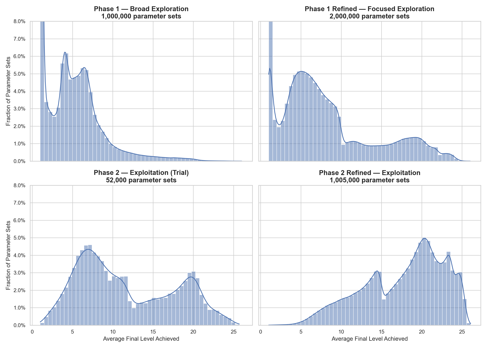
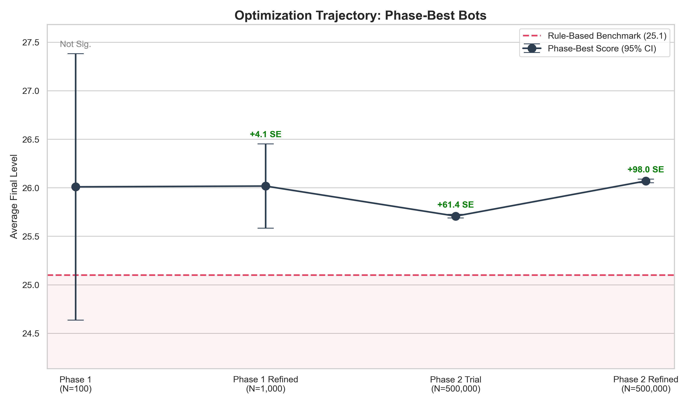

# battleMage Optimization

This project explores how to evaluate and compare decision strategies in a stochastic environment, where outcomes are noisy and strong strategies are rare.

The setting is *battleMage*, a programmable combat simulation I originally built as a teaching system for AP Computer Science. What began as a pedagogical environment evolved into a practical optimization problem: given a fully specified stochastic system, how should decision parameters be tuned to achieve the strongest possible performance, and how confident can we be in that result?

The core of the project is a large, multi-phase simulation whose results are analyzed in a single [***Jupyter notebook***](battleMage_Optimization/01_Optimizing_battleMage.ipynb). Most readers should start there.

---

## The Question

Given a fixed ruleset and a fully specified game state:

> **Which decision strategies actually perform well when evaluated across many stochastic trials—and how confident can we be in that evaluation?**

This turns out to be a harder question than it first appears. Single runs are misleading, averages stabilize slowly, and genuinely strong strategies occupy a small and structured region of the search space.

The notebook walks through how these issues show up in practice and how the analysis evolves in response.

---

## What the Notebook Shows

Rather than presenting a single “best” strategy, the notebook focuses on how evidence accumulates as the optimization progresses across phases.

A central visual summary is a 2×2 grid of outcome distributions—one for each optimization phase. Read left to right, top to bottom, these plots show how the search evolves from broad exploration to focused exploitation, and how the shape of the outcome distribution changes as the parameters are tuned.

**Outcome distributions across optimization phases (y-axis capped at 8%).**  

Early phases are wide, noisy, and dominated by poor-performing configurations. Most parameter sets fail badly, and genuinely strong strategies are buried deep in the tail. As the search space is refined, the distribution shifts and reshapes: weak regions are pruned away, structure emerges, and high-performing configurations become more common and more tightly clustered.

What matters most is not just the movement of the right-hand tail, but the increasing *stability* of that tail. Later phases do not dramatically raise the maximum observed score; instead, they dramatically reduce uncertainty. Confidence intervals shrink, estimates stabilize, and performance differences become statistically meaningful rather than anecdotal.

Taken together, these phase-by-phase distributions show why optimization in stochastic systems cannot be evaluated by single runs or small samples. Progress is best understood as a gradual tightening of evidence around a narrow region of consistently strong strategies, rather than a sudden discovery of a lone outlier.

---

## How the System Works (Briefly)

battleMage is **not** a human-playable game. There is no UI and no interactive play.

Instead:
- Decision strategies are implemented as Java classes (referred to here as “bots”)
- Each bot chooses an action based on the current game state
- Performance is evaluated by running many simulated battles and aggregating outcomes

The Java code generates data.  
The Python notebook analyzes it.

### About Learning

A bot’s decision policy is fixed during a battle; learning occurs across repeated simulations rather than within a single episode.

Each bot has access to the complete game state at every turn, including resources, opponent status, and current threat levels. Decisions therefore do not depend on hidden information that would need to be inferred mid-battle.

This design isolates questions of **evaluation under stochastic outcomes**, rather than online adaptation.

---

## How to Engage With the Project

### Recommended: Read the Notebook

Start with:

[***01_Optimizing_battleMage.ipynb***](battleMage_Optimization/01_Optimizing_battleMage.ipynb)

The notebook:
- Loads precomputed simulation results
- Walks through the analysis phase by phase
- Explains why each analytical choice is made

It is designed to be readable without running any code.

### Optional: Inspect the Simulation Code

Readers interested in system design can explore the [***Java source***](/BotBattler/src) to see:
- How decisions are encoded
- How game state evolves
- How outcomes are scored

Running the full optimization pipeline is computationally expensive and not required to understand the analysis.

---

## Data and Reproducibility

All simulation data is precomputed and released as a static dataset via GitHub Releases.

The notebook does not generate simulation data; it only analyzes the released results. Instructions for obtaining the dataset are provided in `data/README.md`.

This approach reflects the stateful, multi-phase nature of the optimization process while keeping the analysis itself transparent and reproducible.

---

## Scope and Limitations

- Results are specific to the chosen ruleset and opponent model  
- Optimization targets expected (average) performance, not worst-case guarantees  
- Strategy space is defined by a fixed parameterization  
- No learning or adaptation occurs within a single battle  

These constraints are intentional. They make it possible to evaluate strategies using high-confidence statistical estimates rather than single-run outcomes, and to meaningfully compare competing configurations.

---

## Closing Note

Although the setting is a combat simulation, the underlying problem is a familiar one: optimizing decisions in the presence of stochastic noise.

This project applies large-scale simulation and progressively tighter evaluation to show that, for systems with known dynamics and full state observability, careful parameter tuning can converge on a robust, high-confidence solution—provided uncertainty is treated as a first-class concern.
